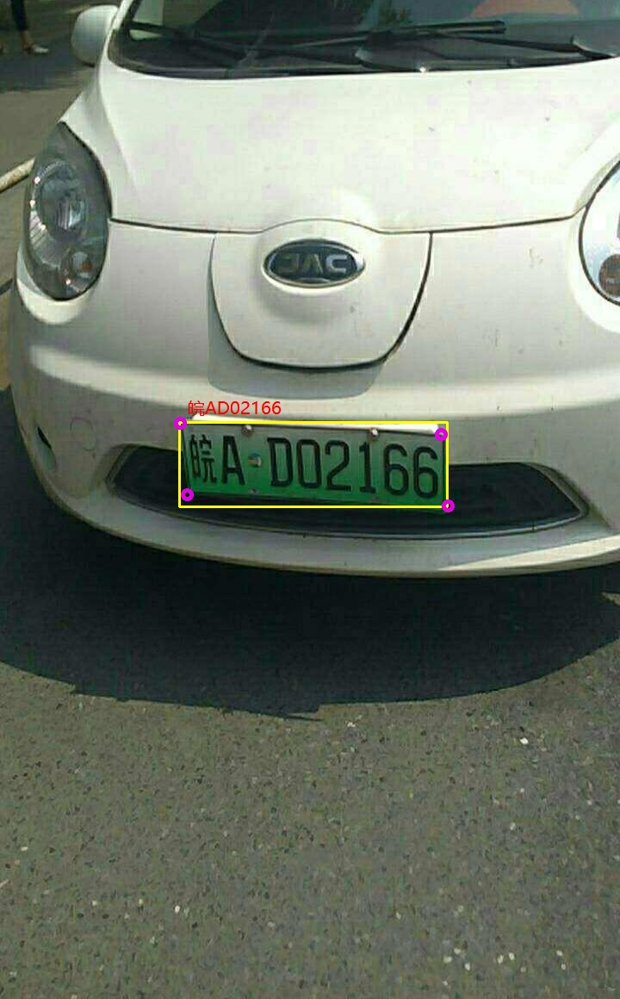

# LPR ONNX=>TensorRT

## 1.Reference

LP detect and recognize

- [RetinaLP](https://github.com/zeusees/License-Plate-Detector)
- [LPRNet](https://github.com/sirius-ai/LPRNet_Pytorch)

## 2.Export ONNX Model

- ```
  git clone https://github.com/zeusees/License-Plate-Detector.git
  ```

- copy [export_det.py](export_det.py)    [export_rec.py](export_rec.py)    [LP_det.py](LP_det.py)   [LP_rec.py](LP_rec.py)  
```
python export_det.py
python export_rec.py
```
LPRNet permute[batch,68,18] to [batch,18,68] 

## 3.TRT

RetinaLP

**INPUT**

[batch,3,1280,1280]

LPRNet 

**INPUT**

[batch,3,24,94]

## 4.Results

