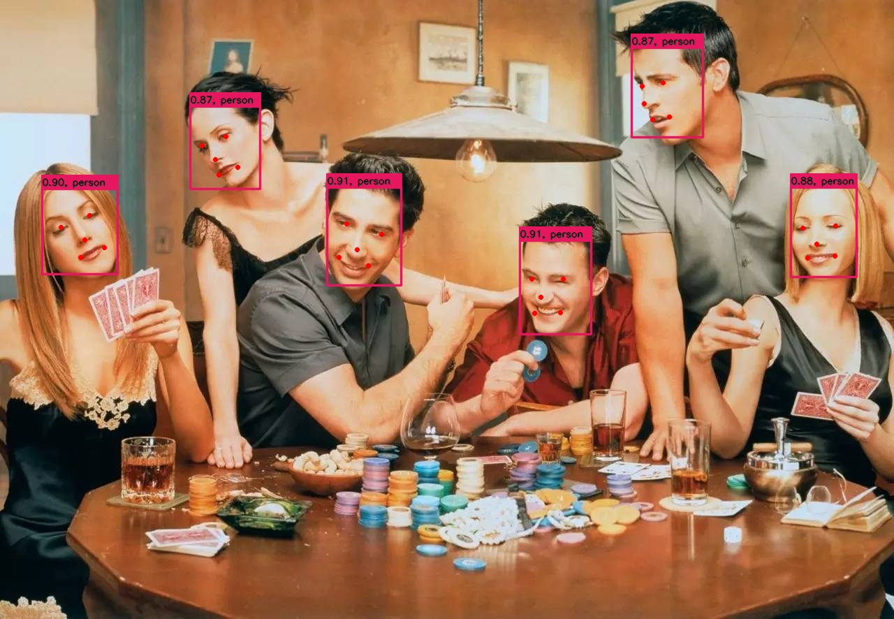

# CenterFace Network ONNX=>TensorRT

## 1.Reference
- **CenterFace github:** [https://github.com/Star-Clouds/CenterFace](https://github.com/Star-Clouds/CenterFace)
- **CenterFace arxiv:** [CenterFace: Joint Face Detection and Alignment Using Face as Point](https://arxiv.org/abs/1911.03599)
- **get pretrained model:** [centerface.onnx](https://github.com/Star-Clouds/CenterFace/blob/master/models/onnx/centerface.onnx) or [centerface_bnmerged.onnx](https://github.com/Star-Clouds/CenterFace/blob/master/models/onnx/centerface_bnmerged.onnx)

## 2.Export ONNX Model
- export `centerface.onnx `model
```
python3 export_onnx.py
```
- export `centerface_bnmerged.onnx `model
```
python3 export_onnx.py  --pretrained ./centerface_bnmerged.onnx --onnx ./centerface_bnmerged.onnx
```

## 3.TRT

**INPUT**

[batch_size,3,640,640]

**OUTPUT**

[batch_size,1,160,160]

[batch_size,2,160,160]

[batch_size,2,160,160]

[batch_size,10,160,160]

**dynamic shape**

define the input/output data as variables of dynamic shape (batch_size,3,640,640).

[issue](https://github.com/onnx/onnx-tensorrt/issues/328)

## 4.Results

