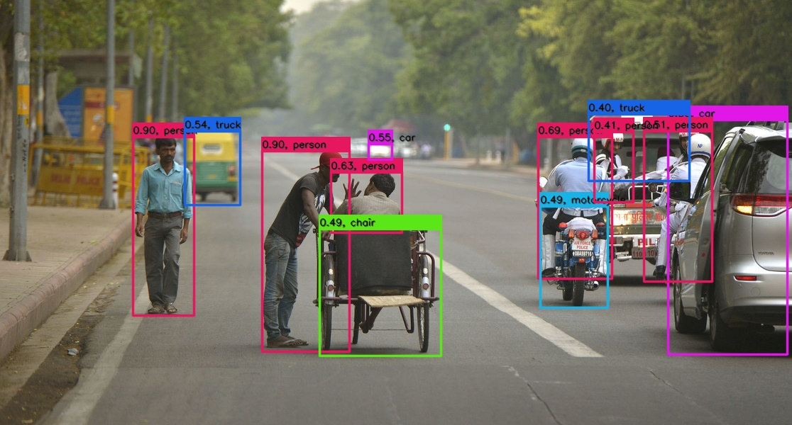

# CenterNet PyTorch=>ONNX=>TensorRT

## 1.ReferenceN
- CenterNet: https://github.com/xingyizhou/CenterNet

## 2.Export ONNX Model
copy [export_onnx.py](export_onnx.py) 
```
python3 export_onnx.py
```

Don't support dynamic batch

## 3.TRT

**INPUT**

[1,3,640,640]

**OUTPUT**

[1,80,160,160]

[1,2,160,160]

[1,2,160,160]

[1,80,160,160]

## 4.Results

