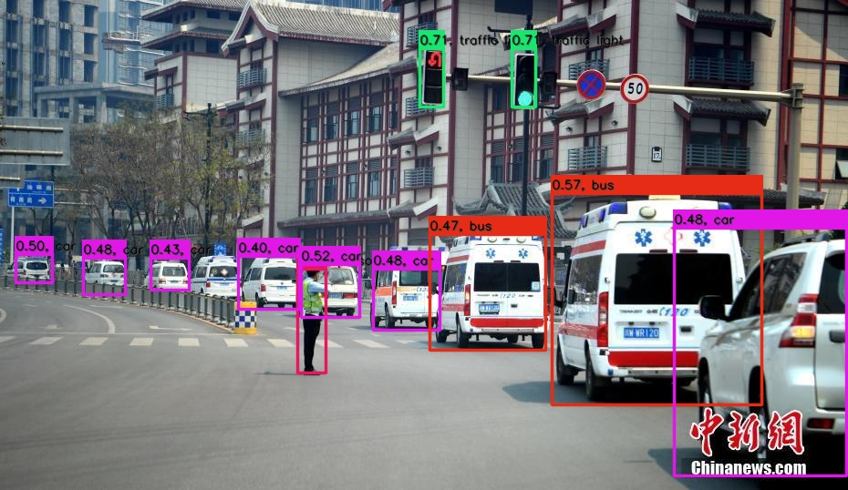
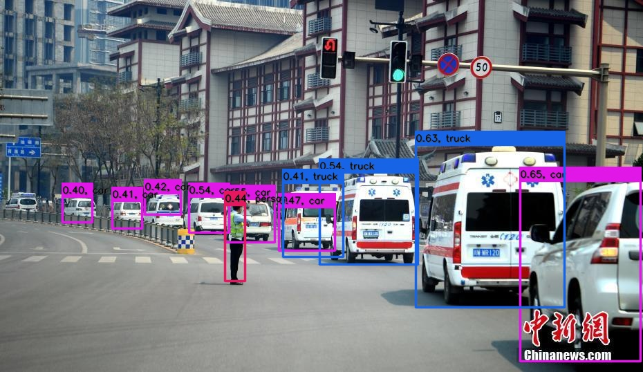

# Nanodet PyTorch=>ONNX=>TensorRT

## 1.Reference
- **nanodet:** [https://github.com/RangiLyu/nanodet](https://github.com/RangiLyu/nanodet)
- get nanodet pretrained weights from here: [COCO pretrain weight for torch>=1.6(Google Drive)](https://drive.google.com/file/d/1EhMqGozKfqEfw8y9ftbi1jhYu86XoW62/view?usp=sharing) | [COCO pretrain weight for torch<=1.5(Google Drive)](https://drive.google.com/file/d/10h-0qLMCgYvWQvKULqbkLvmirFR-w9NN/view?usp=sharing)

## 2.Export ONNX Model
```
git clone https://github.com/RangiLyu/nanodet.git
```
copy [export.py](export.py) into `nanodet/tools` and run `export.py` to generate `nanodet-m.onnx`.

not support dynamic batch

```
python3 tools/export.py
```

## 3.TRT

**INPUT**

[1,3,320,320]

**OUTPUT**

[1,1600,80]

[1,400,80]

[1,100,80]

[1,1600,32]

[1,400,32]

[1,100,32]

## 4.Results

nanodet-m

nanodet-g

nanodet-EfficientNet-Lite0_320

nanodet-EfficientNet-Lite1_416

nanodet-EfficientNet-Lite2_512

nanodet-RepVGG-A0_416