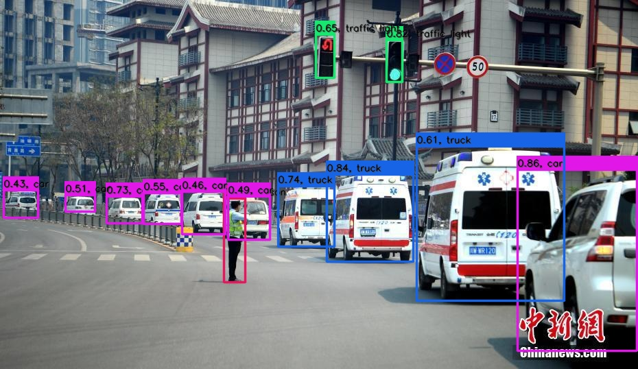

# YOLOv5 PyTorch=>ONNX=>TensorRT

## 1.Reference
- **yolov5:** [https://github.com/ultralytics/yolov5](https://github.com/ultralytics/yolov5)
- get yolov5 weights from here: [yolov5s](https://github.com/ultralytics/yolov5/releases/download/v3.0/yolov5s.pt), [yolov5m](https://github.com/ultralytics/yolov5/releases/download/v3.0/yolov5m.pt), [yolov5l](https://github.com/ultralytics/yolov5/releases/download/v3.0/yolov5l.pt), [yolov5x](https://github.com/ultralytics/yolov5/releases/download/v3.0/yolov5x.pt).

## 2.Export ONNX Model
```
git clone https://github.com/ultralytics/yolov5.git
```
copy [export_onnx.py](export_onnx.py) 、[yolo.py](yolo.py) into `yolov5/models` and run `export_onnx.py` to generate `yolov5s.onnx` and yolov3-spp、yolov3-tiny、yolov4、yolov5 so on.
```
python3 models/export_onnx.py --weights ./weights/yolov5s.pt --img 640
```

## 3.TRT

**INPUT**

[batch_size,3,640,640]

**OUTPUT**

[batch_size,255,80,80]

[batch_size,255,40,40]

[batch_size,255,20,20]

## 4.Results

