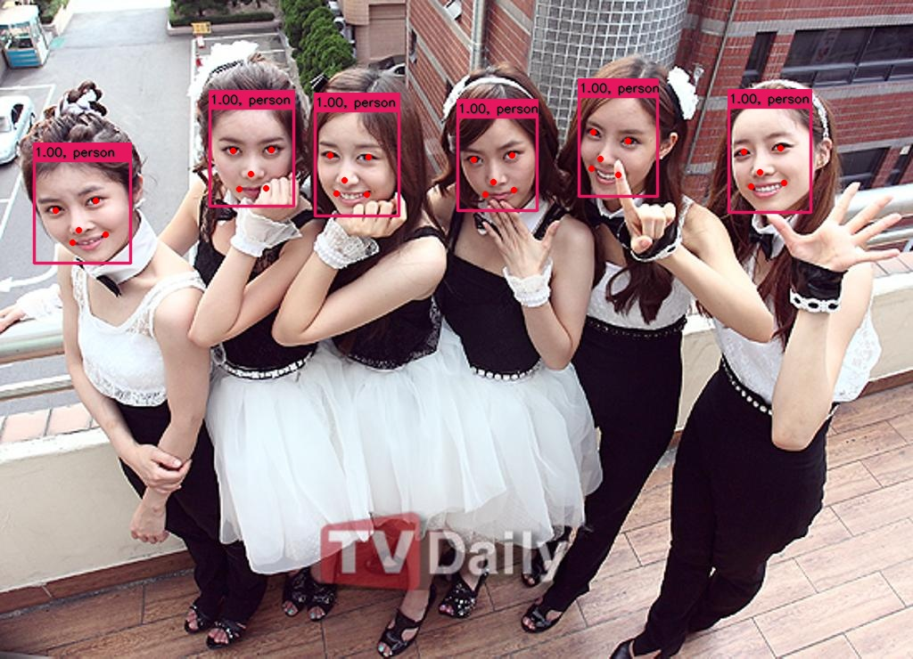
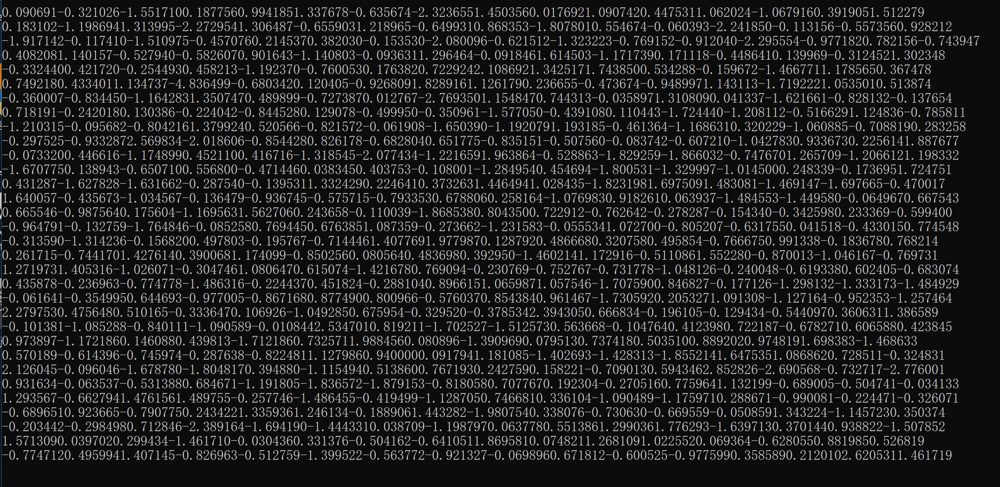

# ArcFace Network MxNet=>ONNX=>TensorRT

## 1.Reference
- **insightface github:** https://github.com/deepinsight/insightface
- **Pytorch_Retinaface:** https://github.com/biubug6/Pytorch_Retinaface
- **mnn_example:** https://github.com/MirrorYuChen/mnn_example

## 2.Export ONNX Model

- copy [mxnet2onnx_demo.py](./mxnet/mxnet2onnx_demo.py) to `insightface/recognition/ArcFace` 

```
python3 mxnet2onnx_demo.py
```

- **mxnet2onnx:** https://github.com/zheshipinyinMc/arcface_retinaface_mxnet2onnx

```
python3 mxnet2onnx_demo.py

# mxnet2onnx_test() #==mxnet2onnx
# onnx_modify_demo() #===onnx修改===
# onnx_inferred_demo() #===onnx前向推导===
```
**dynamic batch size** with bug

[issue](https://github.com/SthPhoenix/InsightFace-REST/issues/9)、[issue](https://github.com/onnx/onnx-tensorrt/pull/569)

## 3.TRT

**INPUT**

[1,3,112,112]

**OUTPUT**

[1,512]

## 4.Results

- retinaface result



- face location|face_aligned


- arcface feature 512

