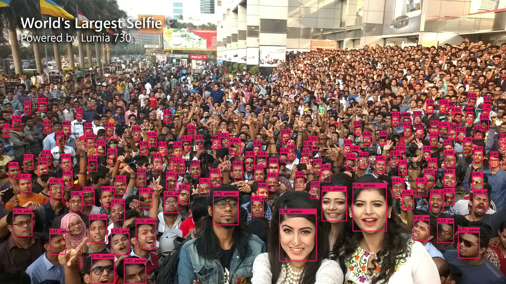

# DBFace Network ONNX=>TensorRT

## 1.Reference
- DBFace github: https://github.com/dlunion/DBFace

## 2.Export ONNX Model
- copy [export_onnx.py](export_onnx.py)  
```
python3 export_onnx.py
```
Don't support dynamic batch

## 3.TRT

**INPUT**

[1,3,640,640]

**OUTPUT**

[1,1,160,160]

[1,4,160,160]

[1,10,160,160]

[1,1,160,160]

## 4.Results

