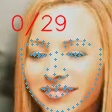
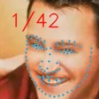

# gender-age |alignment MxNet=>ONNX=>TensorRT

## 1.Reference
- **insightface github:** https://github.com/deepinsight/insightface

## 2.Export ONNX Model

- copy [mxnet2onnx_demo.py](./mxnet/mxnet2onnx_demo.py) to `insightface/gender-age` 

```
python3 mxnet2onnx_demo.py
```

gender-age **dynamic batch size** with bug 

[fixed export onnx](https://zhuanlan.zhihu.com/p/166267806)

BN / PReLU slop

## 3.TRT

gender-age

**INPUT**

[1,3,112,112]

**OUTPUT**

[1,202]

alignment 

**INPUT**

[1,3,192,192]

**OUTPUT**

[1,212]

## 4.Results

- gender-age |  alignment 106

