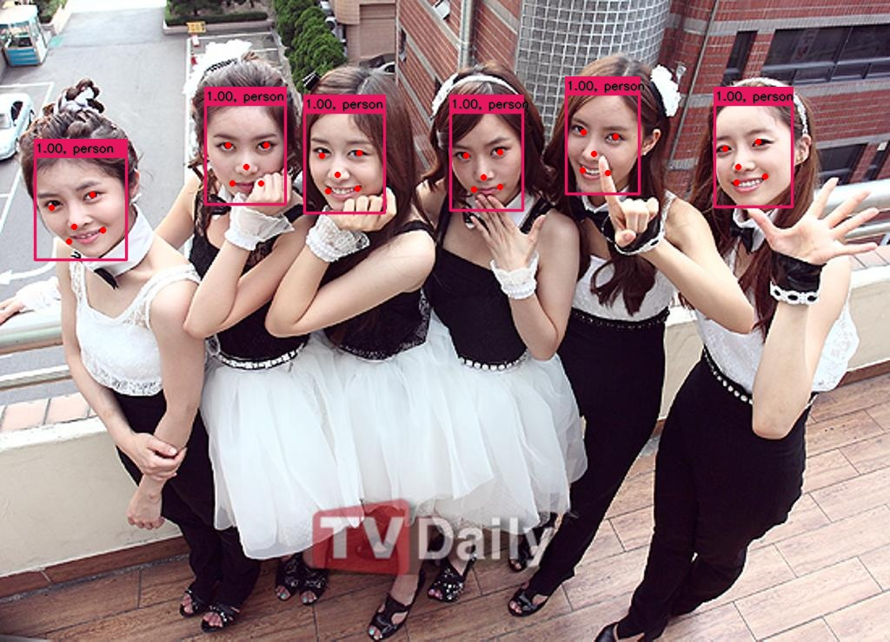

# RetinaFace PyTorch=>ONNX=>TensorRT

## 1.Reference
- **RetinaFace arxiv:** [RetinaFace: Single-stage Dense Face Localisation in the Wild](https://arxiv.org/abs/1905.00641)
- **RetinaFace pytorch:** https://github.com/biubug6/Pytorch_Retinaface
- [**RetinaFace mxnet**]( https://github.com/deepinsight/insightface/tree/master/detection/RetinaFace)

Pretrain model and trained model are put in [google cloud](https://drive.google.com/open?id=1oZRSG0ZegbVkVwUd8wUIQx8W7yfZ_ki1) and [baidu cloud](https://pan.baidu.com/s/12h97Fy1RYuqMMIV-RpzdPg) Password: fstq 

## 2.Export ONNX Model
- clone RetinaFace code
```
git clone https://github.com/biubug6/Pytorch_Retinaface.git
```
copy [export_onnx.py](export_onnx.py)、 [retinaface.py](retinaface.py)，to `./Pytorch_Retinaface` 
- export resnet50 model
```
python3 export_onnx.py --trained_model ./weights/Resnet50_Final.pth --network Resnet50
```
- export mobilenet 0.25 model
```
python3 export_onnx.py 
```
## 3.TRT

**INPUT**

[batch_size,3,640,640]

**OUTPUT**

[batch_size,1,16800,4]

[batch_size,1,16800,2]

[batch_size,1,16800,10]

## 4.Results

- Resnet50 result


- mobilenet0.25 result


